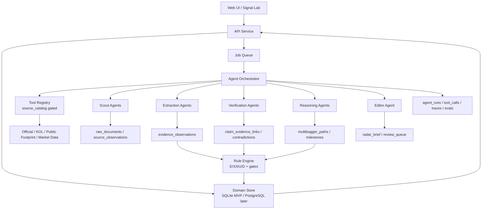
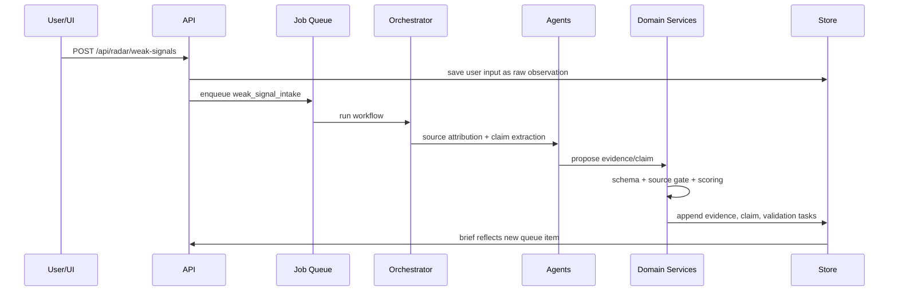

# Agent-native 早期多倍股雷达架构设计

验证日期：2026-06-02

适用范围：

- `docs/specs/early-multibagger-radar-redesign.md`
- `docs/specs/information-source-cost-classification.md`
- `docs/specs/mvp-usable-cutline.md`
- 当前本地 MVP：`cic/*`、`web/*`

## 1. 结论

本项目应该用 agent-native 的方式开发，但不能做成「Agent 自己决定股票状态」。

正确架构是：

```text
Agent 负责发现、阅读、提取、归因、比对、反驳、生成验证任务。
规则引擎负责评分、门禁、状态迁移、阻断和谨慎失败。
数据库负责事实、证据、claim、历史修订、审计和复盘。
用户负责最终研究判断和任何交易相关动作。
```

也就是说，Agent 是系统的研究劳动力，不是系统的大脑。真正的系统大脑是「证据图谱 + 规则状态机 + 历史复盘」。

## 2. 已核实现状

| 位置 | 当前能力 | 架构含义 |
| --- | --- | --- |
| `cic/llm.py` | 只有一个 OpenAI-compatible chat-completions 客户端，输出靠 `extract_json_object` 容错。 | 还不是 agent-native，也没有 schema 强约束、trace、tool run、agent run 记录。 |
| `cic/report.py` | `analyze_holdings` 一次性分析输入持仓，生成 brief。 | 当前是同步报告函数，不是事件驱动工作流。 |
| `cic/rules.py` | 规则引擎已经控制 R/O/T/Q、低等级来源阻断、风险门禁。 | 这是正确边界，后续必须保留为确定性 gate。 |
| `cic/storage.py` | JSON store 保存 reports 和 decisions。 | 需要扩展成 append-only event store 或 SQLite/PostgreSQL。 |
| `docs/specs/early-multibagger-radar-redesign.md` | 已定义 evidence、source_profiles、claims、claim_revisions、contradictions、paths、milestones、validation_tasks。 | 已具备 agent-native 的领域对象基础。 |
| `docs/specs/information-source-cost-classification.md` | 已定义 source_catalog、cost_class、access_mode、license_status、automation_allowed。 | Agent 工具调用必须受来源目录和授权门禁控制。 |

当前最大架构缺口：

1. 缺 Agent Runtime。
2. 缺 Tool Registry。
3. 缺 Workflow Orchestrator。
4. 缺强 JSON Schema/Pydantic 输出。
5. 缺 agent_runs、tool_calls、trace、evals。
6. 缺异步任务、重试、幂等和人工复核节点。

## 3. 设计原则

### 3.1 Agent-native 的定义

本项目里的 agent-native 不是「每个功能都让大模型自由推理」，而是：

1. 每个 Agent 有明确职责、输入 schema、输出 schema、可用工具和失败策略。
2. 每次 Agent 运行都有 `agent_run_id`、`trace_id`、prompt 版本、模型版本、输入对象 ID 和输出 JSON。
3. Agent 只能提出结构化候选事实或建议，不能直接改 `radar_state`。
4. Agent 使用工具必须通过 `source_catalog` 授权检查。
5. 重要状态变化必须由 deterministic domain service 计算并落库。
6. 高风险输出必须进入人工复核。

### 3.2 最重要的工程边界

| 边界 | Agent 可做 | Agent 不可做 |
| --- | --- | --- |
| 信息发现 | 提议新来源、新 claim、新验证任务 | 绕过授权抓取 restricted 来源 |
| 文档阅读 | 提取 claim、事实、反方、未知项 | 把推理当事实落库 |
| 交叉验证 | 生成 evidence link 候选 | 自行提高 X 分并升级候选 |
| 历史比对 | 生成 diff 摘要 | 覆盖旧 claim 或删除历史 |
| 路径推演 | 生成 12 个月路径草案 | 输出确定性收益预测 |
| 主编报告 | 排序、解释、给复核问题 | 给无条件买入/卖出指令 |

## 4. 总体架构



## 5. 核心服务拆分

### 5.1 API Service

职责：

1. 接收 UI 请求。
2. 校验请求 schema。
3. 读取 radar brief、claim、evidence graph。
4. 创建用户决策。
5. 投递异步 job。

MVP 可以继续用 Python stdlib HTTP server，但建议尽快切到 FastAPI，因为 agent-native 会有后台任务、schema、streaming 和异步状态。

推荐 API：

```text
POST /api/radar/weak-signals
POST /api/radar/evidence
POST /api/radar/run
GET  /api/radar/jobs/{job_id}
GET  /api/radar/brief
GET  /api/radar/claims/{claim_id}
GET  /api/radar/claims/{claim_id}/evidence-graph
GET  /api/radar/validation-tasks
POST /api/radar/validation-tasks/{task_id}/complete
POST /api/radar/claims/{claim_id}/decision
```

### 5.2 Domain Store

MVP 选择：

1. SQLite：优先推荐。
2. JSONL：可用于 agent_runs/tool_calls/raw events，但不适合作为主查询库。
3. PostgreSQL：第二阶段迁移。

原因：

- SQLite 足够本地优先。
- 比 JSON store 更适合 claim graph、索引、幂等和历史 diff。
- 后续迁移 PostgreSQL 时 schema 成本低。

最低表：

```text
source_catalog
source_profiles
raw_documents
evidence_observations
claims
claim_evidence_links
claim_revisions
contradictions
validation_tasks
multibagger_paths
path_milestones
agent_runs
tool_calls
human_reviews
radar_briefs
```

### 5.3 Job Queue

MVP 可用 SQLite job table，不需要一开始上 Celery。

```sql
CREATE TABLE jobs (
  job_id TEXT PRIMARY KEY,
  job_type TEXT NOT NULL,
  payload_json TEXT NOT NULL,
  status TEXT NOT NULL CHECK (status IN ('queued', 'running', 'succeeded', 'failed', 'cancelled')),
  priority INTEGER NOT NULL DEFAULT 50,
  idempotency_key TEXT NOT NULL,
  attempts INTEGER NOT NULL DEFAULT 0,
  max_attempts INTEGER NOT NULL DEFAULT 3,
  created_at TEXT NOT NULL,
  started_at TEXT,
  finished_at TEXT,
  error TEXT,
  UNIQUE (job_type, idempotency_key)
);
```

关键 job 类型：

```text
ingest_source
extract_claims
attribute_source
profile_kol
link_claim_evidence
cross_validate_claim
diff_claim_history
build_multibagger_path
generate_bear_case
compose_radar_brief
expire_milestones
run_evals
```

## 6. Agent 拓扑

### 6.1 Orchestrator Agent

职责：

- 不是做投资判断，而是拆任务、选择 Agent、调工具、汇总结构化输出。
- 所有工具调用前先查 `source_catalog`。
- 所有 Agent 输出写入 `agent_runs`，再交给 domain service 校验。

输入：

```json
{
  "workflow": "weak_signal_intake",
  "trigger_object_type": "user_note",
  "trigger_object_id": "note_001",
  "budget": {
    "max_agent_runs": 8,
    "max_tool_calls": 20,
    "allow_paid_sources": false
  }
}
```

输出：

```json
{
  "workflow_run_id": "wf_001",
  "recommended_domain_actions": [
    {"action": "create_evidence_observation", "object_id": "ev_001"},
    {"action": "create_validation_task", "object_id": "task_001"}
  ],
  "blocked_actions": [
    {"reason": "source_license_unknown", "source_id": "x_api"}
  ],
  "review_required": true
}
```

### 6.2 Scout Agents

Scout Agent 是发现者，不是判断者。

| Agent | 工具 | 输出 |
| --- | --- | --- |
| Official Disclosure Scout | 公告 URL、文件上传、交易所/巨潮适配器 | `raw_documents` |
| Public Footprint Scout | 公司官网、客户官网、招聘、专利、招投标 | `source_observations` |
| KOL Scout | curated KOL list、手动 X 链接、截图/文本 | `evidence_observations` 草案 |
| Market Scout | 行情、板块、peer 数据 | `market_observations` |
| Policy/Industry Scout | 政策、协会、行业数据 | `industry_observations` |

MVP 优先级：

1. 手动 URL/文件/文本输入。
2. 免费官方公告。
3. KOL 手动 curated list。
4. 行情/财务 CSV 或 Tushare/AKShare。
5. 自动抓取放后。

### 6.3 Extraction Agents

Extraction Agent 必须只输出结构化对象。

```json
{
  "agent_name": "claim_extractor",
  "input_document_id": "doc_001",
  "claims": [
    {
      "claim_text": "公司某产品已进入客户试用阶段",
      "claim_type": "customer_adoption",
      "stock_code": "300000.SZ",
      "stance": "support",
      "source_rank": "C",
      "source_family": "expert_kol",
      "raw_excerpt": "原文片段",
      "confidence": 0.72,
      "unknowns": ["客户名称未确认", "是否形成收入未知"]
    }
  ],
  "facts": [],
  "inferences": [],
  "opinions": []
}
```

Schema 规则：

- `raw_excerpt` 必填。
- `facts/inferences/opinions` 必须分离。
- `confidence < 0.6` 的 claim 不可自动入库，只能进入 review queue。
- 输出 schema 校验失败则整次 agent run 失败，不落事实库。

### 6.4 Verification Agents

| Agent | 输入 | 输出 |
| --- | --- | --- |
| Source Attribution Agent | evidence + source_catalog | `source_rank`、`source_family`、`independence_group` |
| Claim Linker Agent | new evidence + existing claims | `claim_evidence_links` 候选 |
| Cross Validation Agent | claim graph | X 分、缺失来源家族、冲突候选 |
| Historical Diff Agent | claim + revisions + new evidence | `claim_revisions` 草案 |
| Contradiction Agent | 支持/反对证据 | `contradictions` 草案 |

注意：这些 Agent 只生成草案。最终 `claim_evidence_links`、X 分和状态迁移由 Domain Service 重算。

### 6.5 Reasoning Agents

| Agent | 作用 | 硬限制 |
| --- | --- | --- |
| Path Builder | 生成 12 个月路径和 milestone | 必须包含 failure case 和 kill condition |
| Bear Case Agent | 反驳看多路径 | 每条 bear case 必须绑定证据或未知项 |
| Scenario Agent | 生成 base/upside/failure case | 不能输出确定收益承诺 |
| Editor Agent | 生成 brief | 不能新增事实，只能引用已有 object_id |

## 7. Deterministic Domain Services

Agent-native 架构的成败在这里。

### 7.1 Source Gate

输入：`source_id`、`requested_access_mode`、`workflow`

输出：

```json
{
  "allowed": false,
  "reason": "license_status_unknown",
  "fallback": "manual_upload_only"
}
```

规则：

1. `license_status=unknown` 不允许自动抓取。
2. `restricted_do_not_automate` 永远不允许自动抓取。
3. `paid_purchase_required=true` 且未授权时，不能进生产任务。
4. `browser_cookie` 只能人工触发，默认不能定时任务。

### 7.2 Evidence Normalizer

职责：

- 生成稳定 `evidence_id`。
- 计算 `independence_group`。
- 去重。
- 清洗原文摘录。
- 绑定 `source_id` 和 `source_profile_id`。

### 7.3 Claim Graph Service

职责：

- 创建/更新 claim。
- 链接 evidence。
- 保存 revision。
- 计算 contradiction_count。
- 保证所有历史 append-only。

禁止：

- 覆盖旧 claim 文本。
- 删除旧 evidence。
- 用 LLM 输出直接替换事实。

### 7.4 Radar Scoring Service

职责：

- 计算 E/X/I/U/D。
- 计算 R/O/T/Q 作为成熟候选二级评分。
- 执行 source gate、risk gate、KOL-only gate、low-rank gate。

状态迁移规则：

```text
Agent output
  ↓
schema validation
  ↓
source/license gate
  ↓
evidence normalization
  ↓
claim graph update
  ↓
deterministic scoring
  ↓
radar_state transition
  ↓
human review if required
```

### 7.5 Human Review Service

触发条件：

1. 进入 `asymmetric_candidate`。
2. A/B 级证据与核心 claim 冲突。
3. KOL source_rank 升级到 B。
4. paid source 被请求。
5. 分数跳变超过阈值。
6. Agent 输出 confidence 低但影响大。

## 8. 工作流设计

### 8.1 弱信号录入



### 8.2 每日雷达批处理

顺序：

1. `expire_milestones`
2. `ingest_source` for allowed free/official/manual sources
3. `extract_claims`
4. `attribute_source`
5. `link_claim_evidence`
6. `cross_validate_claim`
7. `diff_claim_history`
8. `build_multibagger_path` for eligible claims
9. `generate_bear_case`
10. `compose_radar_brief`

可以并行：

- 不同 source 的 ingestion。
- 不同 raw document 的 extraction。
- 不同 claim 的 cross validation。

必须串行：

- 同一 claim 的 revision。
- 同一 path 的 milestone 状态更新。
- 状态迁移和 human review 创建。

## 9. Provider 架构

### 9.1 Model Provider Adapter

不要把 OpenAI 或智谱直接写进 Agent 业务代码。需要统一接口：

```python
class ModelProvider:
    def run_json(self, *, agent_name, prompt_version, input_json, output_schema, tools, trace_context):
        ...
```

Provider 实现：

```text
OpenAIResponsesProvider
OpenAIAgentsProvider
OpenAICompatibleChatProvider
HeuristicProvider
```

MVP 路线：

1. 先保留 `OpenAICompatibleChatProvider`，兼容智谱 Coding Plan API。
2. 新增 schema validation 和 agent_runs。
3. 再接 OpenAI Responses / Agents SDK。
4. Provider 不同，但 domain output schema 必须一样。

### 9.2 OpenAI/Agents 官方能力映射

官方文档显示：

- Responses API 支持 stateful response、built-in tools、MCP tools、function calling 和 structured outputs。
- Agents SDK 支持 agentic apps、tools、handoffs、streaming 和 tracing。
- Agents SDK tracing 会记录 LLM generation、tool call、handoff、guardrail 等事件；默认 tracing 开启，且敏感输入输出默认可能被纳入 trace，需要显式关闭或自建 tracing processor。
- Structured Outputs 可以让模型输出符合 JSON Schema；严格 schema 要求对象设置 `additionalProperties: false`。

工程决策：

1. 投研敏感数据默认关闭 OpenAI hosted tracing 的敏感内容。
2. 本地必须保存自己的 `agent_runs` 和 `tool_calls`。
3. 所有 Agent 输出用 Pydantic/JSON Schema 校验。
4. Responses/Agents 只作为执行层，不作为事实存储层。

## 10. Tool Registry

Agent 可用工具必须是白名单。

```text
get_source_catalog(source_id)
fetch_official_announcement(source_id, url)
save_raw_document(source_id, payload)
extract_text_from_pdf(doc_id)
lookup_market_snapshot(stock_code, date_range)
lookup_existing_claims(stock_code)
lookup_source_profile(platform, handle)
create_validation_task(claim_id, question, required_source_family)
propose_claim_evidence_link(claim_id, evidence_id, link_type)
```

工具设计原则：

1. 工具只返回结构化数据。
2. 工具内部执行授权检查。
3. 工具调用必须写 `tool_calls`。
4. 工具不允许直接生成最终报告。
5. 写工具必须支持 idempotency key。

## 11. Observability

最低审计表：

```sql
CREATE TABLE agent_runs (
  agent_run_id TEXT PRIMARY KEY,
  workflow_run_id TEXT NOT NULL,
  agent_name TEXT NOT NULL,
  provider TEXT NOT NULL,
  model TEXT NOT NULL,
  prompt_version TEXT NOT NULL,
  input_object_ids TEXT NOT NULL,
  output_object_ids TEXT,
  output_schema_name TEXT NOT NULL,
  status TEXT NOT NULL CHECK (status IN ('succeeded', 'failed', 'blocked', 'fallback')),
  trace_id TEXT,
  tokens_in INTEGER,
  tokens_out INTEGER,
  cost_estimate NUMERIC,
  started_at TEXT NOT NULL,
  finished_at TEXT,
  error TEXT
);

CREATE TABLE tool_calls (
  tool_call_id TEXT PRIMARY KEY,
  agent_run_id TEXT NOT NULL REFERENCES agent_runs(agent_run_id),
  tool_name TEXT NOT NULL,
  input_json TEXT NOT NULL,
  output_json TEXT,
  status TEXT NOT NULL CHECK (status IN ('succeeded', 'failed', 'blocked')),
  source_id TEXT,
  blocked_reason TEXT,
  started_at TEXT NOT NULL,
  finished_at TEXT
);
```

关键指标：

| 指标 | 目标 |
| --- | --- |
| weak_signal_to_validation_task_rate | 100% |
| kol_only_candidate_escape_count | 0 |
| schema_validation_failure_rate | < 5% |
| source_license_block_count | 可见且可解释 |
| claim_revision_coverage | 100% |
| manual_review_queue_latency | 当日可见 |
| false_positive_by_source_family | 月度复盘 |
| hit_rate_by_agent_prompt_version | 月度复盘 |

## 12. 错误和救援策略

| 失败模式 | 用户看到 | 系统救援 |
| --- | --- | --- |
| LLM 不可用 | 报告标记 fallback | 使用 heuristic provider，只生成验证任务不升级 |
| Schema 校验失败 | 该 Agent 输出不落库 | 保存 failed agent_run，重试或进入人工复核 |
| 来源授权未知 | 来源被阻断 | 生成 manual_upload task |
| 同一证据重复抓取 | 不重复加分 | `independence_group` 去重 |
| KOL 高质量但无独立验证 | 进入 validation_queue | 阻断 candidate |
| A/B 级反证出现 | 今日 brief 置顶 | 创建 contradiction + human review |
| 任务并发更新同一 claim | 不产生覆盖 | claim-level lock 或事务串行 |
| trace 含敏感数据风险 | 不上传敏感内容 | 本地 trace + disable hosted sensitive data |

## 13. 测试策略

### 13.1 单元测试

```text
source_gate_allows_only_authorized_sources
kol_only_never_enters_asymmetric_candidate
schema_invalid_agent_output_is_not_persisted
same_independence_group_does_not_increase_X
claim_revision_is_append_only
contradiction_from_A_level_evidence_requires_review
```

### 13.2 集成测试

```text
weak_signal_intake_creates_evidence_claim_and_validation_task
kol_signal_plus_public_footprint_upgrades_to_evidence_convergence
official_negative_evidence_falsifies_claim
daily_radar_run_composes_brief_with_milestones_due
```

### 13.3 Agent evals

每个 Agent 都要有固定样例集：

| Agent | Eval |
| --- | --- |
| Claim Extractor | 从公告/帖子里提取 claim，事实/推理/观点分离 |
| Source Attribution | 正确归类 source_family/source_rank |
| KOL Profiler | 识别喊单、利益冲突、证据纪律 |
| Historical Diff | 找到旧 claim 和新 evidence 的关系 |
| Bear Case | 找出缺失证据，不编造反方 |
| Editor | 不新增事实，只引用 object_id |

## 14. 实施路线

### Phase 1：Agent-native 基础设施

1. 引入 Pydantic schema。
2. 新增 SQLite store。
3. 新增 `agent_runs`、`tool_calls`、`jobs`。
4. 新增 provider adapter。
5. 保留当前 `/api/holdings/analyze`，新增 `/api/radar/*`。

### Phase 2：弱信号和证据图谱

1. 实现 weak signal intake。
2. 实现 source gate。
3. 实现 evidence normalizer。
4. 实现 claim graph service。
5. 实现 KOL profile。

### Phase 3：Agent 工作流

1. Claim Extraction Agent。
2. Source Attribution Agent。
3. Cross Validation Agent。
4. Historical Diff Agent。
5. Bear Case Agent。
6. Editor Agent。

### Phase 4：路径和复盘

1. Path Builder Agent。
2. Milestone expiry worker。
3. Source/Agent hit-rate dashboard。
4. 月度复盘报告。

### Phase 5：UI 信号实验室

1. 弱信号收件箱。
2. 交叉验证矩阵。
3. Claim revision timeline。
4. 12 个月路径和 kill map。
5. Agent run/audit drawer。

## 15. 需要改造的文件

| 文件/目录 | 改造 |
| --- | --- |
| `cic/models.py` | 拆为 domain models + agent output schemas |
| `cic/storage.py` | 从 JSON store 升级到 SQLite repository |
| `cic/llm.py` | 改为 provider adapter，支持 schema validation |
| `cic/report.py` | 保留旧 MVP report，新增 radar workflow service |
| `cic/rules.py` | 抽出 deterministic domain services |
| `cic/server.py` | 新增 `/api/radar/*` 和 job status |
| `web/index.html` | 新增 Signal Lab |
| `web/app.js` | 支持 radar brief、claim graph、job polling |
| `tests/` | 增加 agent schema、workflow、source gate、claim graph 测试 |

建议新增目录：

```text
cic/agents/
cic/domain/
cic/providers/
cic/repositories/
cic/schemas/
cic/tools/
cic/workflows/
cic/evals/
```

## 16. 架构验收标准

1. 任一 Agent 输出 schema 校验失败时，不得写入 evidence/claim/path 主表。
2. 任一自动工具调用前必须通过 `source_catalog` 授权检查。
3. `expert_kol` 单独来源不得进入 `asymmetric_candidate`。
4. 所有状态迁移必须由 deterministic scoring service 执行。
5. 每次 Agent run 必须记录 provider、model、prompt_version、input_object_ids、output_schema_name、status。
6. 每次 tool call 必须记录 tool_name、source_id、status、blocked_reason。
7. 弱信号录入后必须生成 evidence、claim、validation_task 或明确 blocked reason。
8. 旧 claim 更新必须生成 claim_revision，不允许原地覆盖。
9. A/B 级反证必须生成 contradiction 和 human review。
10. LLM provider 不可用时，系统仍能生成谨慎 fallback brief。
11. 现有 `python -m unittest discover -s tests` 保持通过。
12. 新增 agent-native workflow 测试覆盖主要失败路径。

## 17. 工程评审结论

**OK**：方向应该 agent-native，因为早期多倍股雷达天然需要多来源、多任务、多轮验证和历史记忆。

**CRITICAL GAP**：Agent 不能成为状态机。状态迁移必须由规则服务完成，否则系统会变成不可复核的荐股机器人。

**WARNING**：不要一开始上复杂分布式系统。MVP 用 SQLite + job table + provider adapter 足够；等真实数据和工作流证明价值后再迁移 PostgreSQL、Redis、Prefect 或 Celery。

**推荐实施**：按 `docs/specs/mvp-usable-cutline.md` 先做 `POST /api/radar/analyze`、样例雷达 JSON、KOL-only gate、交叉验证、验证任务和最小前端展示。完整 Agent Runtime、SQLite/job queue、自动抓取、Signal Lab 和 eval dashboard 都等第一份可审阅雷达报告跑通后再做。

## 18. 参考资料

1. OpenAI Agents SDK: https://developers.openai.com/api/docs/guides/agents
2. OpenAI Responses API: https://developers.openai.com/api/reference/resources/responses/methods/create
3. OpenAI Structured Outputs: https://developers.openai.com/api/docs/guides/structured-outputs
4. OpenAI Agents SDK tracing: https://openai.github.io/openai-agents-python/tracing/
