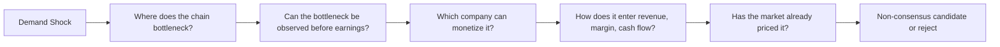

# Non-Consensus Alpha First Principles

This note captures the current product-design conversation for Critical Investment Consultant. It should be read as a design constraint, not as a new module request.

## Core Realization

The radar must not become a consensus compression engine.

Most searchable information is already digested by someone else: media, research reports, public summaries, and even many KOL takes. If the system only collects more of that information, it will converge toward the market's current consensus. That makes the report feel complete but not sharp.

The valuable target is different:

> Find an uncertain industry scenario where one concrete market signal, once realized, will concentrate into revenue, margin, or order growth for a small set of supply-chain bottleneck companies before consensus fully prices it.

For early multibagger candidates, the key is not "more information". The key is a path:

```text
demand shock
  -> supply bottleneck
  -> observable physical signal
  -> company mapping
  -> financial transmission
  -> underpriced expectation gap
```

## What The System Should Look For

The system should prioritize raw, physical, and operational signals over already-digested conclusions.

| Signal class | What to watch | Why it matters |
| --- | --- | --- |
| Demand shock | AI capex, data center buildout, local substitution, policy pull | Creates the possibility of a re-rating, but is usually too broad alone |
| Supply bottleneck | capacity shortage, material shortage, certification gate, delivery lead time | Converts broad demand into concentrated beneficiary companies |
| Physical signal | price increases, inventory drawdown, delivery delay, shortage, channel quote | Often appears before formal reports or financial statements |
| Qualification signal | design win, test pass, customer admission, small batch to volume ramp | Determines which listed company can actually monetize the bottleneck |
| Working-capital signal | inventory, prepayment, contract liability, payable, receivable | Can be bullish stocking or bearish pile-up depending on industry context |
| Pricing gap | low media heat, low research coverage, muted valuation, weak consensus | Separates non-consensus opportunity from already-priced consensus |

## Anti-Pattern: Evidence Pile-Up

The current Forward Alpha flow can collect sources, observations, comparisons, hypotheses, and scenarios. That is useful, but it can still become blind-men-touching-the-elephant analysis when evidence stays fragmented.

Example:

```text
Observation A: operating cash flow is negative.
Observation B: inventory increased quickly.
Observation C: NAND/DRAM prices are rising.
Observation D: enterprise SSD demand is strong.
```

A flat report may conclude "positive cycle plus cash-flow risk". That is not sharp enough.

The sharper question is:

> Is negative operating cash flow an industry-normal stocking behavior during an early storage upcycle, or a company-specific warning that inventory and receivables are deteriorating without real demand?

## Preferred Mental Model

Use one research spine instead of more modules:



The product should keep Radar, Forward Alpha, and DeepDive as execution surfaces, but reports should be organized by this spine.

## Decision: Reduce Modules, Raise Abstraction

Do not add separate macro, industry, peer, and metric agents by default.

Instead, fold those needs into a single interpretation layer inside the existing flow:

```text
metric interpretation = industry regime + peer baseline + company deviation + best explanation
```

For each important metric, output an interpretation card:

```json
{
  "metric": "operating_cashflow_negative",
  "raw_reading": "profit increased sharply but operating cash flow stayed negative",
  "industry_context_question": "is this common in a NAND/DRAM upcycle because companies are stocking before further price increases?",
  "peer_baseline_needed": [
    "peer inventory growth",
    "peer operating cash flow",
    "peer prepayment and payable changes",
    "peer gross margin trend"
  ],
  "possible_explanations": [
    {
      "explanation": "early-cycle stocking to lock low-cost supply",
      "stance": "potentially_bullish",
      "confirming_evidence": [
        "peers also show inventory and prepayment expansion",
        "industry prices continue rising",
        "gross margin improves",
        "inventory impairment does not increase"
      ]
    },
    {
      "explanation": "customer settlement cycle or bargaining-power pressure",
      "stance": "mixed",
      "confirming_evidence": [
        "receivables grow faster than revenue",
        "payment terms lengthen",
        "contract liabilities do not cover inventory expansion"
      ]
    },
    {
      "explanation": "company-specific inventory pile-up",
      "stance": "bearish",
      "confirming_evidence": [
        "peers do not show the same stocking behavior",
        "gross margin weakens",
        "inventory write-down risk rises",
        "sales growth fails to absorb inventory"
      ]
    }
  ],
  "current_best_explanation": "insufficient_peer_context",
  "next_evidence_to_fetch": [
    "peer cash-flow and inventory deltas",
    "channel price continuation",
    "enterprise SSD order or qualification evidence"
  ]
}
```

## Scoring Shift

Forward Alpha should not reward evidence volume by itself.

The scoring center should move from "how many sources support this" to "how early and concentrated is the bottleneck-to-financial-transmission path".

Proposed scoring dimensions:

| Dimension | Meaning |
| --- | --- |
| Bottleneck strength | How hard is the industry constraint, and can it concentrate value? |
| Observability lead | Does the signal appear before earnings, media coverage, or research consensus? |
| Company monetization | Does the company have product fit, qualification, capacity, and customers? |
| Financial transmission | Can the signal plausibly enter revenue, gross margin, cash conversion, or contract liabilities? |
| Consensus gap | Is the market still under-recognizing the path? |
| Falsifiability | Are there concrete conditions that would kill the thesis quickly? |

## Report Shape

The report should lead with thesis-level interpretation, not a source list.

Recommended top-level order:

1. Non-consensus thesis.
2. Industry bottleneck map.
3. Observable early signals.
4. Company monetization path.
5. Metric interpretation cards.
6. Peer baseline and deviation.
7. Financial transmission scenarios.
8. Consensus gap and crowding check.
9. Falsification checklist.
10. Evidence index.

## De-Mediocritization Rules

1. If a signal is already mostly media/research/KOL consensus, reduce its alpha weight.
2. If a signal is raw, physical, operational, and early, increase its exploration priority.
3. If there is no clear bottleneck, do not force a multibagger path.
4. If the company cannot monetize the bottleneck, the industry thesis does not matter.
5. If the working-capital anomaly is not peer-benchmarked, do not classify it as bullish or bearish too early.
6. If the report cannot state what would falsify the thesis, the thesis is not ready.
7. If evidence is fragmented, summarize less and interpret more.

## Implication For 德明利

For 德明利, the high-value question is not simply whether NAND/DRAM prices are rising or whether cash flow is negative.

The high-value question is:

> In a storage upcycle driven by AI and enterprise SSD demand, is 德明利's inventory and cash-flow expansion a rational attempt to lock scarce supply and prepare for customer delivery, or a company-specific overbuild that will later pressure cash flow and margins?

The next report should therefore compare:

- 德明利 inventory / operating cash flow / receivable / payable / contract liability changes.
- Peer memory-module and SSD-chain companies on the same metrics.
- NAND/DRAM and enterprise SSD price continuation.
- Customer qualification, order, and capacity-utilization signals.
- Whether market attention has already priced the scenario.

This keeps the system focused on the first-principles objective: identify non-consensus supply-chain bottleneck transmission before consensus catches up.
